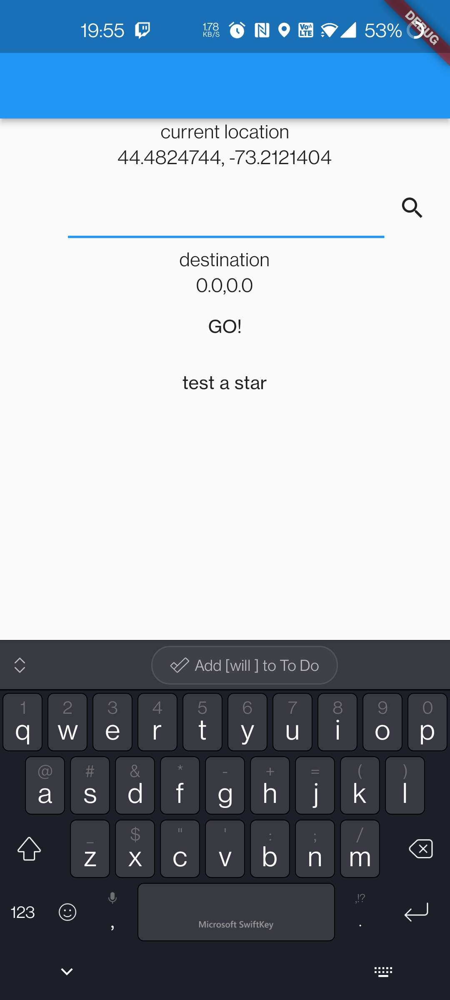
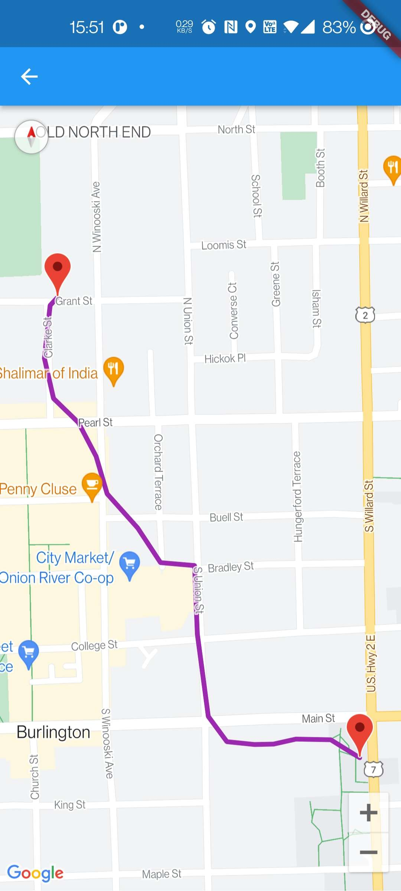
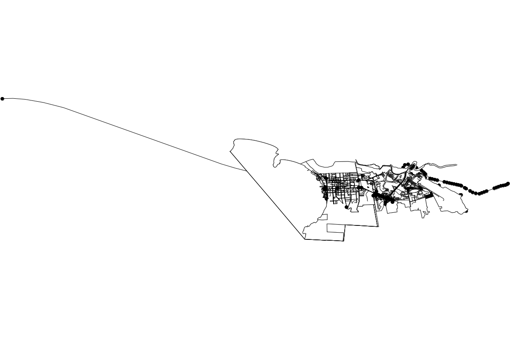

#Fit Map
To build the fit map program you must have flutter on your machine. In a command line, using the command:

	$ flutter run

Will build the program and run it on whatever device. Specifying a term after it such as:

	$ flutter run -d chrome

Will run it as a web app on the chromium browser (Chrome is not supported for this app, however). Full compatability has not been tested. The program at least works on Android mobile devices. 

Using the command:

	$ flutter devices

Will list the devices available currently.

When the app runs, you will see a page like this:

Entering an address into the text bar and then pressing the magnifying glass should change the destination from 0.0, 0.0 to the coordinates of the input address.

Pressing GO! will start the program, which will process for a moment, calculating the path with A\*, and then bring you to a different page with a google map. You may need to zoom in to view it.

Bear in mind, this program only works for the Burlington, Vermont area, starting locations and destinations outside of this area will cause a long delay while A\* tries helplessly to make a path.

This is a visualization of the area covered by the Nodes:

